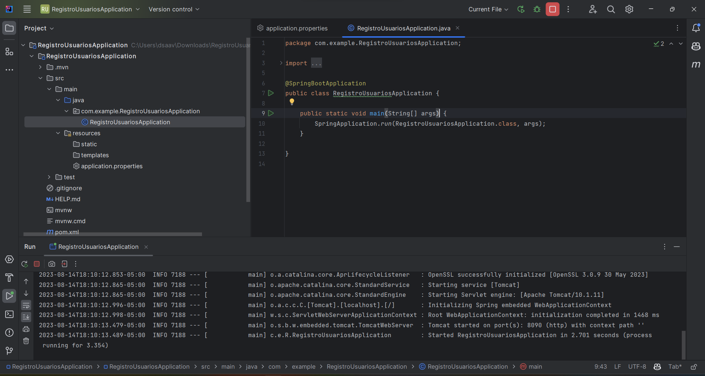
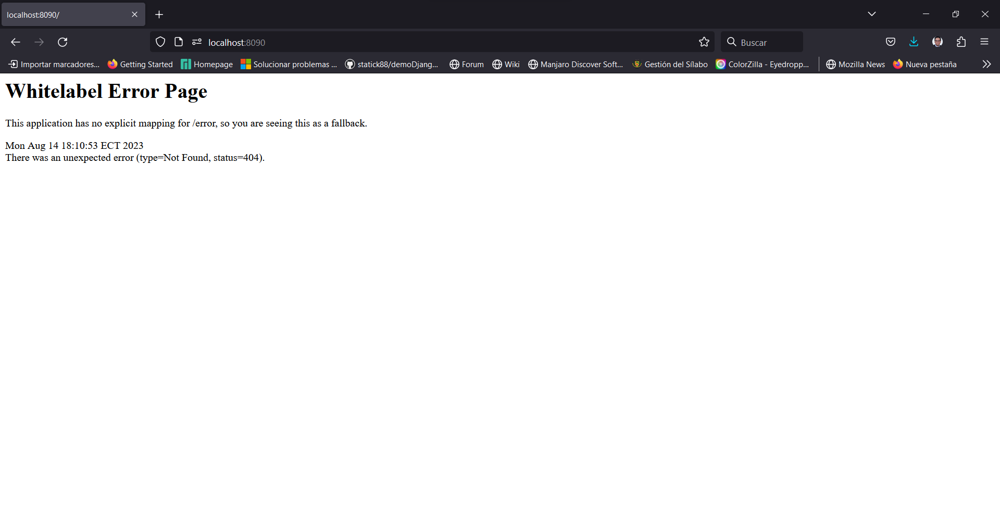

# Módulo 1: Introducción y Configuración del Entorno de Desarrollo

## Paso 1.1: Introducción al proyecto y sus objetivos

En este módulo, nos familiarizaremos con el proyecto **"Aplicación Web de Registro de Usuarios"** y estableceremos los objetivos clave. 

Aprenderemos sobre las tecnologías que utilizaremos y cómo estas se integran para lograr un desarrollo eficiente y efectivo.

## Paso 1.2: Configuración del entorno de desarrollo

1. Instalación de OpenJDK 11 (LTS):
    1.1. Descarga e instala la versión 20 de JDK desde el sitio oficial.
2. Configuración de Intelligent Idea Community:
    2.1. Descarga e instala IntelliJ IDEA Community Edition desde el sitio oficial. 
    2.2. Configura las preferencias y ajustes iniciales.

3. Configuración de Visual Studio Code y el plugin Thunder Client:
    3.1. Instala Visual Studio Code desde el sitio oficial. 
    3.2. Luego, instala el plugin "Thunder Client" para realizar pruebas de API. Configura el plugin según tus necesidades.

4. Instalación y configuración de Docker:
    4.1. Descarga e instala Docker Desktop desde el sitio oficial. 
    4.2. Asegúrate de que Docker esté funcionando correctamente en tu sistema.

## Resumen:

En este módulo, hemos establecido los fundamentos del proyecto y configurado nuestro entorno de desarrollo. Hemos instalado OpenJDK 11, configurado Intelligent Idea Community y Visual Studio Code con el plugin Thunder Client. También hemos instalado y configurado Docker para facilitar el desarrollo y el despliegue de nuestra aplicación.

Práctica del Módulo 1:

1. Crea un proyecto en Intelligent Spring Inizializr llamado "RegistroUsuarios".
2. Configura un nuevo proyecto de Spring Boot utilizando el Initializer en Spring Initializr. Añade las dependencias necesarias, como Spring Web.
3. Crea una clase principal (por ejemplo, "RegistroUsuariosApplication") con el método main para iniciar la aplicación Spring Boot.
4. Verifica que tu entorno de desarrollo esté listo para crear, compilar y ejecutar aplicaciones Spring Boot.

Puedes utilizar este [link](https://start.spring.io/#!type=maven-project&language=java&platformVersion=3.1.2&packaging=jar&jvmVersion=20&groupId=com.example&artifactId=RegistroUsuariosApplication&name=RegistroUsuariosApplication&description=Demo%20project%20for%20Spring%20Boot&packageName=com.example.RegistroUsuariosApplication&dependencies=web)

¡Con estos pasos, has preparado tu entorno y creado el esqueleto básico de tu proyecto! 

En el siguiente módulo, comenzaremos a configurar Spring Boot y PostgreSQL para el manejo de datos en nuestra aplicación.

