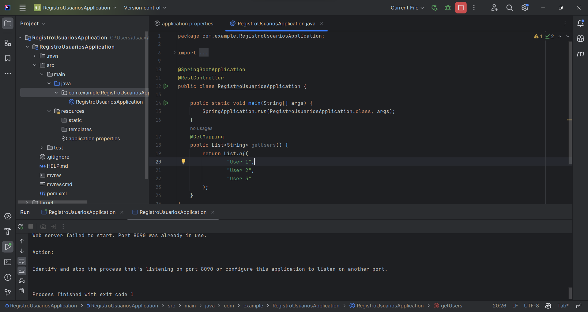
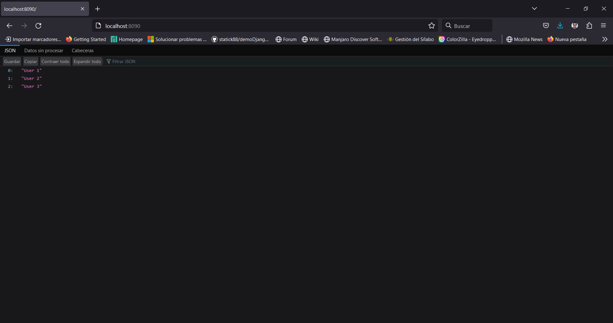
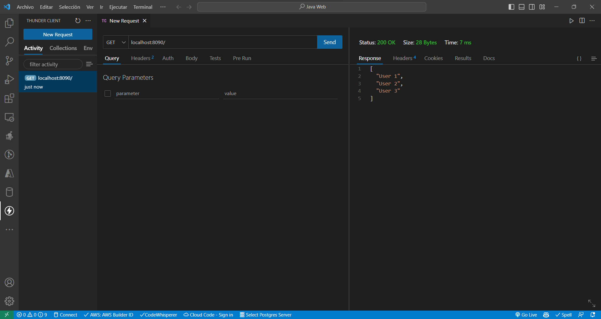

# Módulo 2: Conociendo Spring Boot.

## Primeros pasos.

Para entender como funciona nuestro Framework necesitamos hacer 2 actividades.

1. Correr nuestro proyecto.
2. Analizar la estructura de nuestro proyecto.
3. Jugar un poco con @RestController y @GetMapping.

Podemos jugar con el código de este módulo, pero si quieres hacerlo desde cero, puedes seguir los siguientes pasos:

1. Modificar el Archivo RegistroApplication.java para que tenga el siguiente código:

```java
package com.example.RegistroUsuariosApplication;

import org.springframework.boot.SpringApplication;
import org.springframework.boot.autoconfigure.SpringBootApplication;
import org.springframework.web.bind.annotation.GetMapping;
import org.springframework.web.bind.annotation.RestController;

import java.util.List;

@SpringBootApplication
@RestController
public class RegistroUsuariosApplication {

	public static void main(String[] args) {
		SpringApplication.run(RegistroUsuariosApplication.class, args);
	}
	@GetMapping
	public List<String> getUsers() {
		return List.of(
				"User 1",
				"User 2",
				"User 3"
		);
	}
}
```

Tambien modificamos el archivo **application.properties** para que tenga el siguiente código:

```properties
server.port=8090
```
Podemos elegir el puerto que deseemos, pero es importante que no sea el mismo que el de nuestro servidor de PostgreSQL.

Finalmente corremos nuestro proyecto.






Tambien es posible utilizar el plugin de Vistual Studio Code Thunder Client para hacer peticiones a nuestro servidor.



Tendras una copia de nuestro código en la carpeta código de este módulo.

