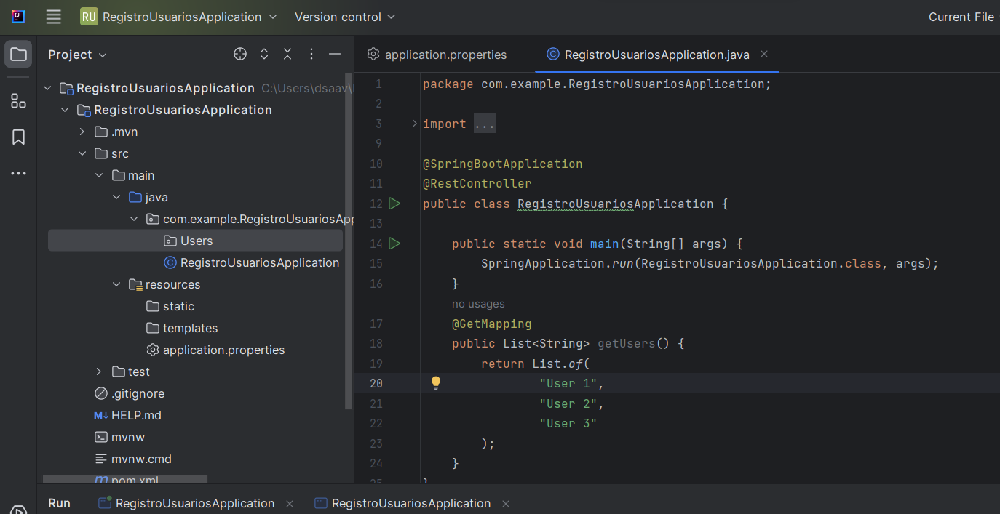
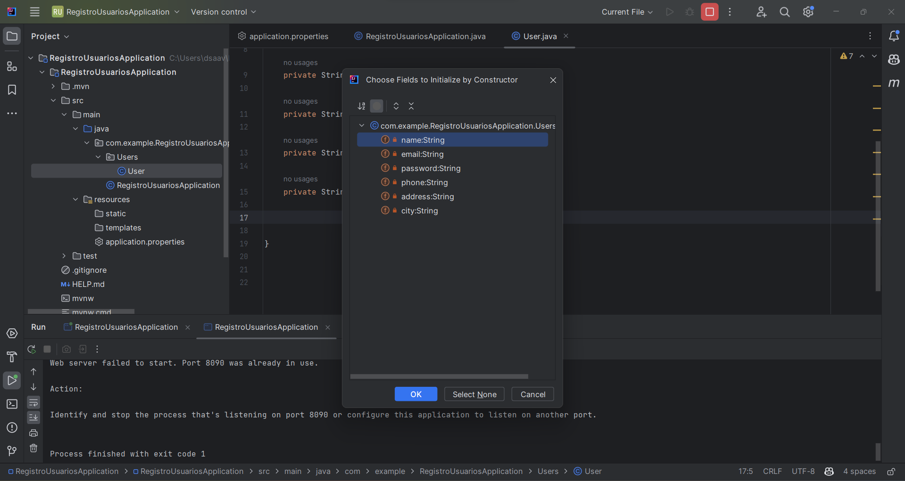
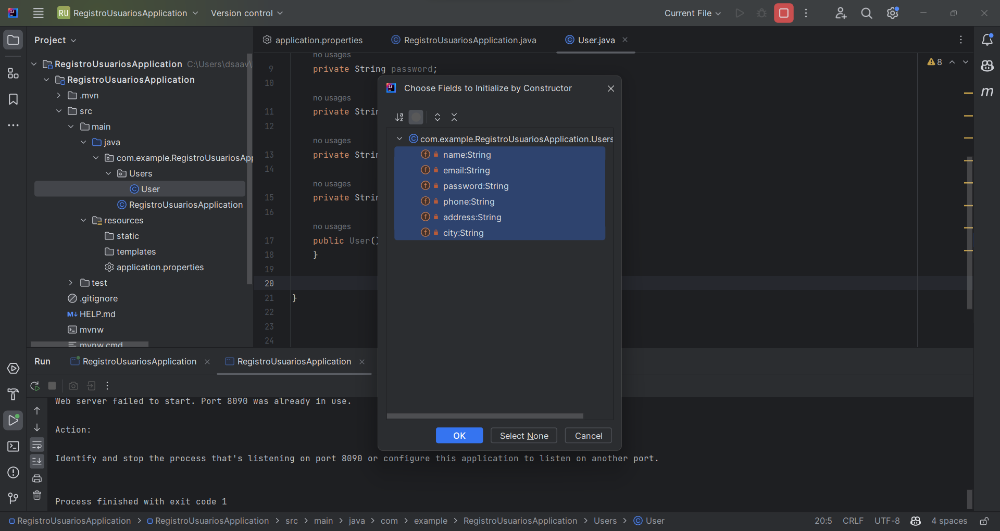
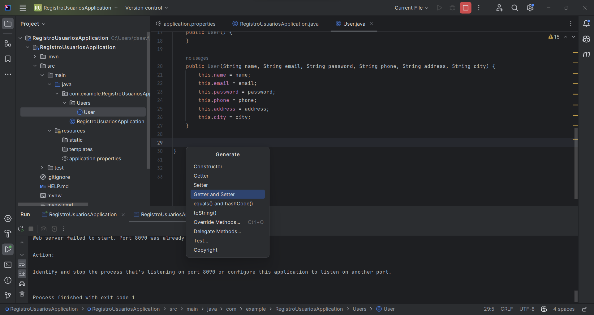
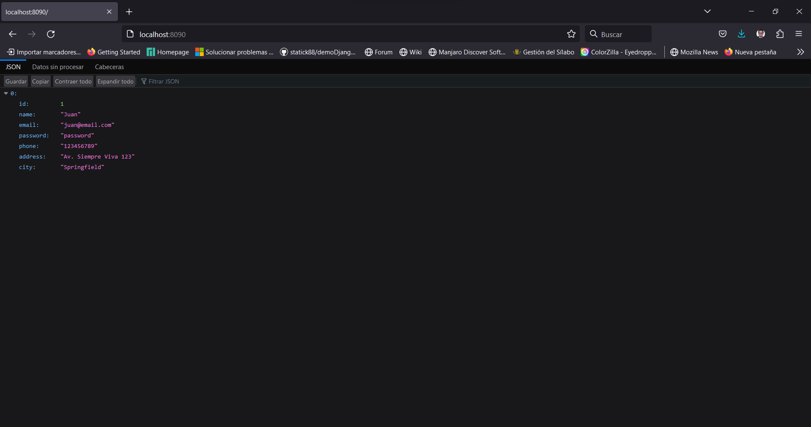

# Módulo 3: Creando nuestro primer paquete Usuario.

## Creando el paquete Usuario

Nos dirigimos a nuestro directorio que contiene a nuestra aplicación principal RegistroUsuariosApplication.java y creamos un nuevo package llamado **Users**.



Ahora creamos una clase llamada Users y le agregamos los siguientes atributos:

```java

package com.example.RegistroUsuariosApplication.Users;

public class User {

    private String name;

    private String email;

    private String password;

    private String phone;

    private String address;

    private String city;
}

```

Tambien creamos un constructor vacio.




Tambien agregamos un constructor cargado de información



Ahora agregamos los Getter and Setter.



Finalmente probamos en el navegador o mediante Thunder Client.



