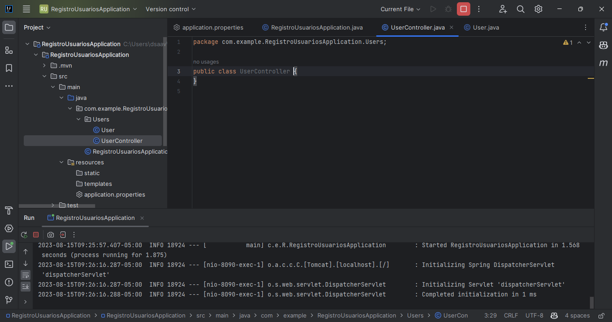
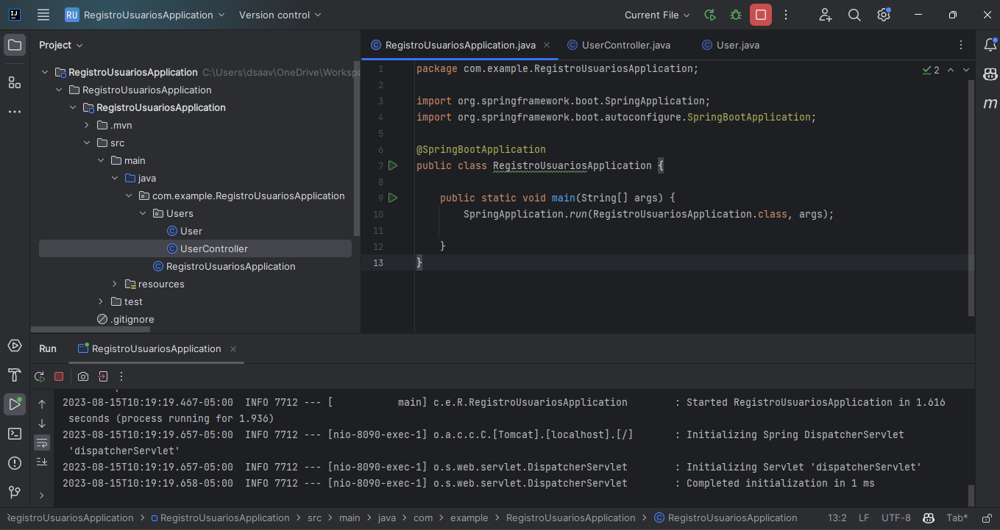
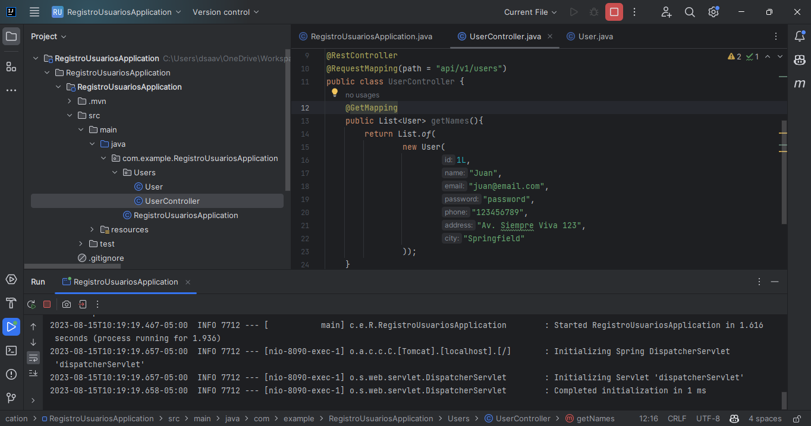
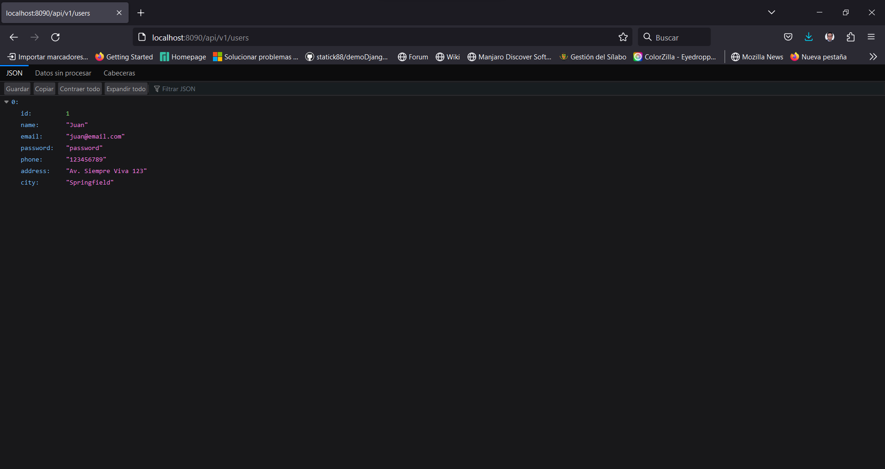
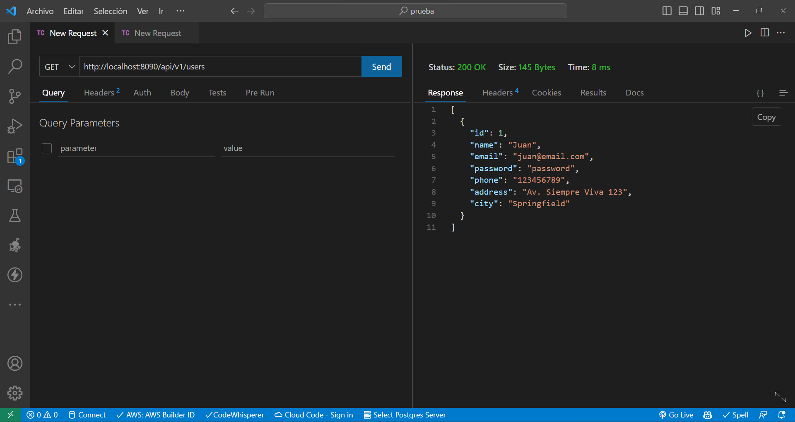

# Módulo 3: Organizando el Proyecto en Package

Vamos avanzando, ahora vamos a crear un Controller para manejar las peticiones de la API, para ello vamos a crear una clase llamada **UserController** dentro del directorio **Users**, esto nos permitirá organizar de mejor forma el código.



Finalmente el código de los archivos queda así


```java
// RegistroUsuariosAppilcation.java

package com.example.RegistroUsuariosApplication;

import org.springframework.boot.SpringApplication;
import org.springframework.boot.autoconfigure.SpringBootApplication;

@SpringBootApplication
public class RegistroUsuariosApplication {

	public static void main(String[] args) {
		SpringApplication.run(RegistroUsuariosApplication.class, args);

	}
}
```

```java
// UserController.java
package com.example.RegistroUsuariosApplication.Users;

import org.springframework.web.bind.annotation.GetMapping;
import org.springframework.web.bind.annotation.RequestMapping;
import org.springframework.web.bind.annotation.RestController;

import java.util.List;

@RestController
@RequestMapping(path = "api/v1/users")
public class UserController {
    @GetMapping
    public List<User> getNames(){
        return List.of(
                new User(
                        1L,
                        "Juan",
                        "juan@email.com",
                        "password",
                        "123456789",
                        "Av. Siempre Viva 123",
                        "Springfield"
                ));
    }
}
```
Ahora ya funciona la nueva ruta de nuestra API medienta el controlador que acabamos de construir.



