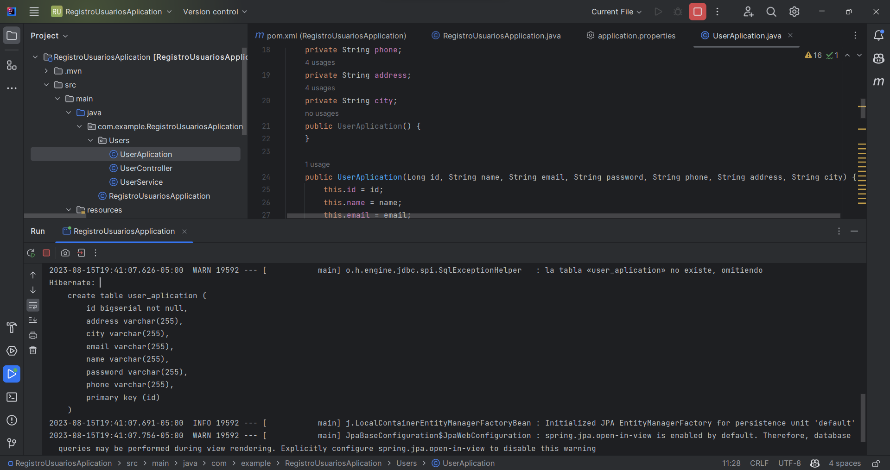
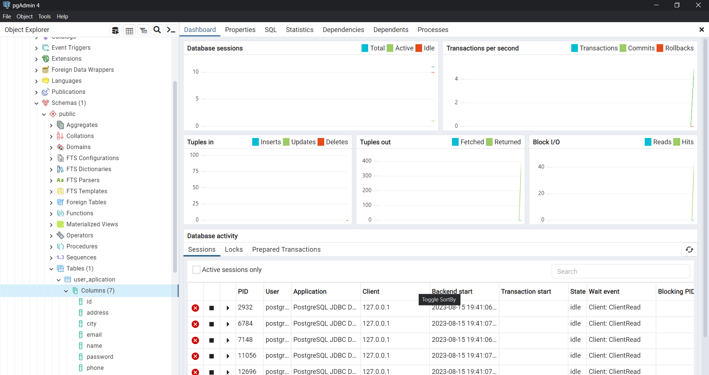
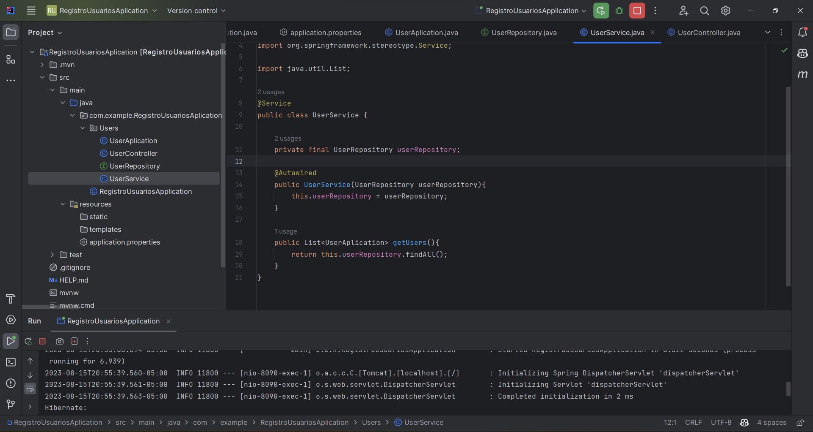
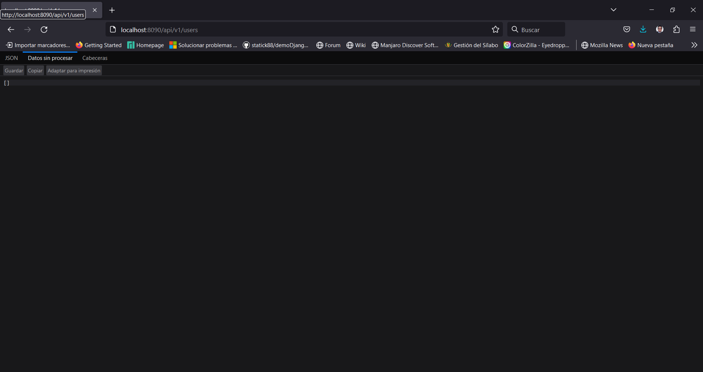
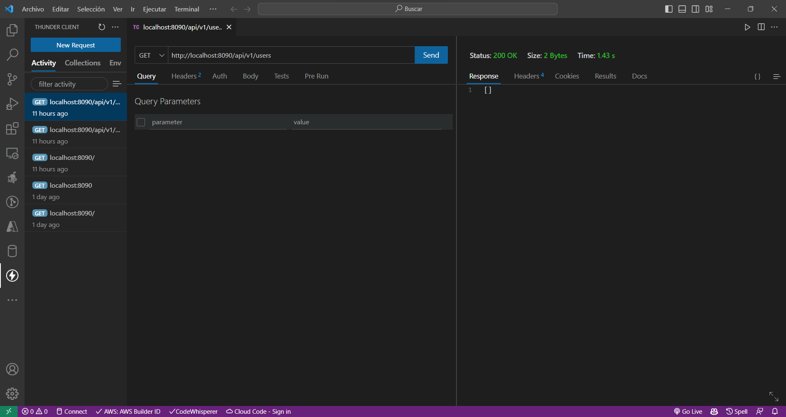

# Módulo 5: Agregando la Capa de Servicio.

Con PGAdmin vamos a crear una base de datos.


En este caso la llame **databaseUser**

En el archivo pom.xml agregamos la dependencia de **spring-boot-starter-data-jpa** y **postgresql**.


Y ahora nos vamos al archivo application.properties y agregamos la configuración de la base de datos.

```properties
server.port = 8090
spring.datasource.url = jdbc:postgresql://localhost:5432/databaseUsers
spring.datasource.username = postgres
spring.datasource.password = D3mon1o.
spring.jpa.hibernate.ddl-auto = create-drop
spring.jpa.show-sql = true
spring.jpa.properties.hibernate.dialect = org.hibernate.dialect.PostgreSQLDialect
spring.jpa.properties.hibernate.format_sql = true

```


Es necesario que renombremos la clase **User** para evitar algunos inconvenientes con PostgreSQL ya que **"user"** es una palabra clave reservada en PostgreSQL, y no puedes usarla directamente como nombre de tabla. PostgreSQL utiliza "user" para referirse a usuarios del sistema.

Para solucionar este problema, necesitas cambiar el nombre de la tabla de "user" a otro nombre que no sea una palabra clave reservada. Por ejemplo, podrías utilizar "UserAplication" o cualquier otro nombre válido.





### Creación de Tablas desde el Framework

Para ello será necesario que creemos una Interface que se llame **UserRepository** y que tenga los siguientes atributos.

``` java
//UserRepository.java

package com.example.RegistroUsuariosAplication.Users;

import org.springframework.data.jpa.repository.JpaRepository;
import org.springframework.stereotype.Repository;

import java.util.List;

@Repository
public interface UserRepository extends JpaRepository<UserAplication, Long> {
}
```
```java
//UserController.java

package com.example.RegistroUsuariosAplication.Users;

import org.springframework.beans.factory.annotation.Autowired;
import org.springframework.web.bind.annotation.GetMapping;
import org.springframework.web.bind.annotation.RequestMapping;
import org.springframework.web.bind.annotation.RestController;

import java.util.List;

@RestController
@RequestMapping(path = "api/v1/users")
public class UserController {

    private final UserService userService;

    @Autowired
    public UserController(UserService userService){
        this.userService = userService;
    }
    @GetMapping
    public List<UserAplication> getNames(){
        return this.userService.getUsers();
    }
}
```
``` java
//UserService.java

package com.example.RegistroUsuariosAplication.Users;

import org.springframework.beans.factory.annotation.Autowired;
import org.springframework.web.bind.annotation.GetMapping;
import org.springframework.web.bind.annotation.RequestMapping;
import org.springframework.web.bind.annotation.RestController;

import java.util.List;

@RestController
@RequestMapping(path = "api/v1/users")
public class UserController {

    private final UserService userService;

    @Autowired
    public UserController(UserService userService){
        this.userService = userService;
    }
    @GetMapping
    public List<UserAplication> getNames(){
        return this.userService.getUsers();
    }
}
```

Al realizar nuevamente la consulta mediante el navegador podemos ver que nos devuelve un arreglo vacío.







Ahora vamos a crear un producto para analizar como funciona.

Para ello nos dirigimos al controlador
