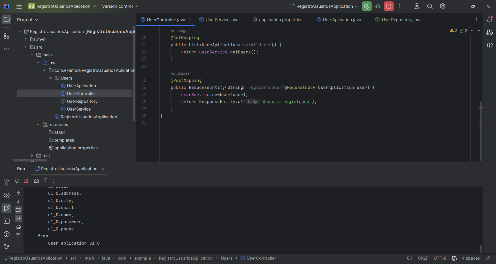
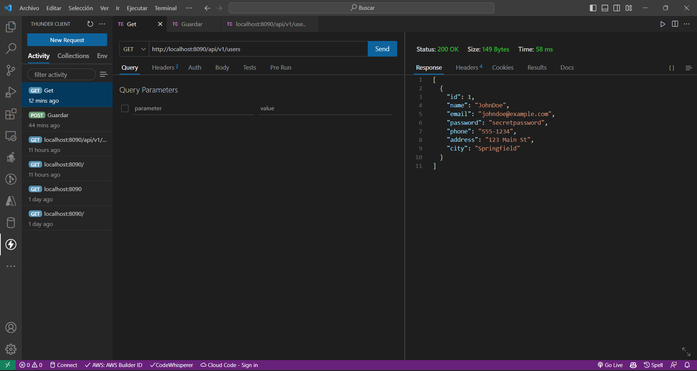

# Módulo 5: Conectandonos a la Base de Datos.

## Conectando a la Base de Datos

Para conectarnos a la base de datos es necesario realizar algunos cambios importantes desde el archivo application.properties.

``` properties
server.port = 8090
spring.datasource.url = jdbc:postgresql://localhost:5432/databaseUsers
spring.datasource.username = postgres
spring.datasource.password = D3mon1o.
spring.jpa.hibernate.ddl-auto = create-drop
spring.jpa.show-sql = true
spring.jpa.properties.hibernate.dialect = org.hibernate.dialect.PostgreSQLDialect
spring.jpa.properties.hibernate.format_sql = true
```
Ahora vamos a crear algunos archivos nuevos y modificar otros.

``` java
//UserApplication

package com.example.RegistroUsuariosAplication.Users;

import jakarta.persistence.*;

@Entity
@Table
public class UserAplication {
    @Id
    @GeneratedValue(strategy = GenerationType.IDENTITY)
    private Long id;
    @Column(unique = true)
    private String name;
    private String email;
    private String password;
    private String phone;
    private String address;
    private String city;
    public UserAplication() {
    }

    public UserAplication(Long id, String name, String email, String password, String phone, String address, String city) {
        this.id = id;
        this.name = name;
        this.email = email;
        this.password = password;
        this.phone = phone;
        this.address = address;
        this.city = city;
    }

    public UserAplication(String name, String email, String password, String phone, String address, String city) {
        this.name = name;
        this.email = email;
        this.password = password;
        this.phone = phone;
        this.address = address;
        this.city = city;
    }

    public Long getId() {
        return id;
    }

    public void setId(Long id) {
        this.id = id;
    }

    public String getName() {
        return name;
    }

    public void setName(String name) {
        this.name = name;
    }

    public String getEmail() {
        return email;
    }

    public void setEmail(String email) {
        this.email = email;
    }

    public String getPassword() {
        return password;
    }

    public void setPassword(String password) {
        this.password = password;
    }

    public String getPhone() {
        return phone;
    }

    public void setPhone(String phone) {
        this.phone = phone;
    }

    public String getAddress() {
        return address;
    }

    public void setAddress(String address) {
        this.address = address;
    }

    public String getCity() {
        return city;
    }

    public void setCity(String city) {
        this.city = city;
    }
}
```
``` java
//UserRepository

package com.example.RegistroUsuariosAplication.Users;

import org.springframework.data.jpa.repository.JpaRepository;
import org.springframework.stereotype.Repository;

import javax.swing.text.html.Option;
import java.util.List;
import java.util.Optional;

@Repository
public interface UserRepository extends JpaRepository<UserAplication, Long> {

    Optional<UserAplication> findUserAplicationByName(String name);

}
```
En este punto vamos a agregar el método newUser() en UserService y el método registrarUser() en UserController.
``` java
//UserService
package com.example.RegistroUsuariosAplication.Users;

import org.springframework.beans.factory.annotation.Autowired;
import org.springframework.stereotype.Service;

import java.util.List;
import java.util.Optional;

@Service
public class UserService {

    private final UserRepository userRepository;

    @Autowired
    public UserService(UserRepository userRepository){
        this.userRepository = userRepository;
    }

    public List<UserAplication> getUsers(){
        return this.userRepository.findAll();
    }

    public void newUser(UserAplication user) {
        Optional<UserAplication> existingUser = userRepository.findUserAplicationByName(user.getName());
        if(existingUser.isPresent()){
            throw new IllegalStateException("El usuario ya existe");
        }
        userRepository.save(user);
    }
}

```

``` java
//UserController

package com.example.RegistroUsuariosAplication.Users;

import org.springframework.beans.factory.annotation.Autowired;
import org.springframework.http.ResponseEntity;
import org.springframework.web.bind.annotation.*;

import java.util.List;

@RestController
@RequestMapping(path = "api/v1/users")
public class UserController {

    private final UserService userService;

    @Autowired
    public UserController(UserService userService) {
        this.userService = userService;
    }

    @GetMapping
    public List<UserAplication> getAllUsers() {
        return userService.getUsers();
    }

    @PostMapping
    public ResponseEntity<String> registrarUser(@RequestBody UserAplication user) {
        userService.newUser(user);
        return ResponseEntity.ok("Usuario registrado");
    }
}
```

Si todo sale bien deberiamos tener los siguientes resultados.




