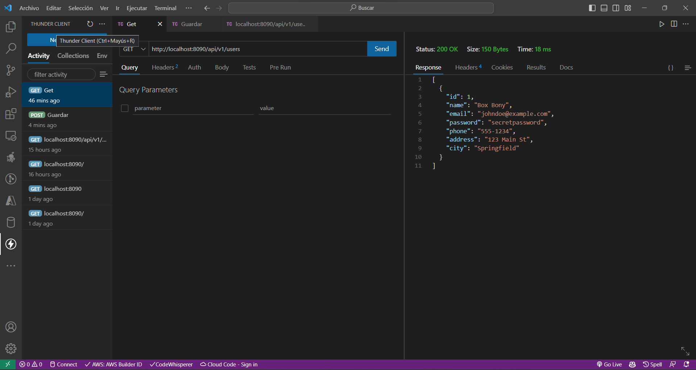

# Módulo 5: Conectandonos a la Base de Datos.

## Respuesta diferente

Vamos a jugar un poco con la respuesta que obtenemos, para ello empezamos modificando el archivo **UserService** con la intención de mejorar las respuestas que obtenemos mediante las peticiones http

``` java
//UserService

package com.example.RegistroUsuariosAplication.Users;

import org.springframework.beans.factory.annotation.Autowired;
import org.springframework.http.HttpStatus;
import org.springframework.http.ResponseEntity;
import org.springframework.stereotype.Service;

import java.net.http.HttpResponse;
import java.util.HashMap;
import java.util.List;
import java.util.Optional;
@Service
public class UserService {

    private final UserRepository userRepository;

    @Autowired
    public UserService(UserRepository userRepository){
        this.userRepository = userRepository;
    }

    public List<UserAplication> getUsers(){
        return this.userRepository.findAll();
    }

    public ResponseEntity<Object> newUser(UserAplication user) {
        Optional<UserAplication> existingUser = userRepository.findUserAplicationByName(user.getName());
        HashMap<String, Object> datos = new HashMap<String, Object>();

        if(existingUser.isPresent()){
            datos.put("data", true);
            datos.put("message", "El usuario ya existe");
            return new ResponseEntity<>(
            datos,
            HttpStatus.CONFLICT
            );
        }
        userRepository.save(user);
        datos.put("data", user);
        datos.put("message", "Usuario creado");
        return new ResponseEntity<>(
                datos,
                HttpStatus.CREATED
        );
    }
}
```





