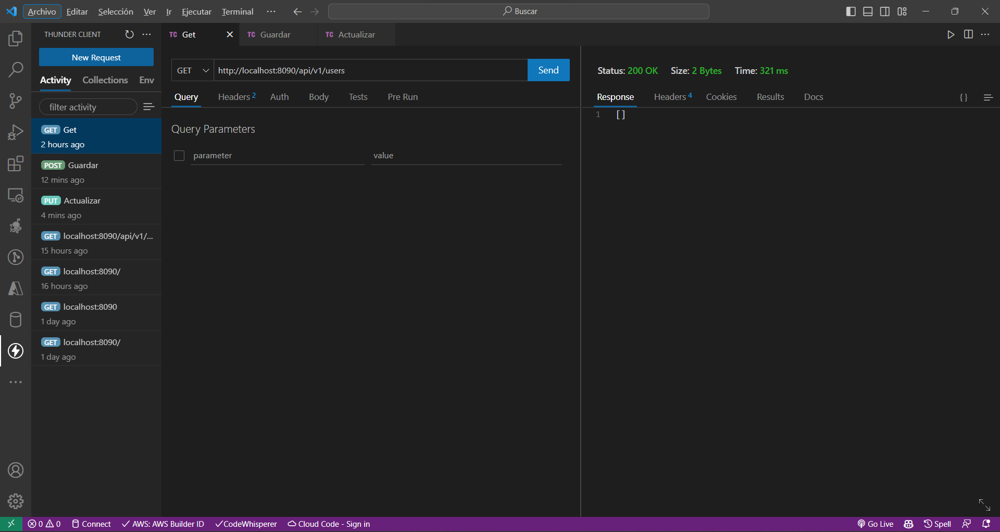
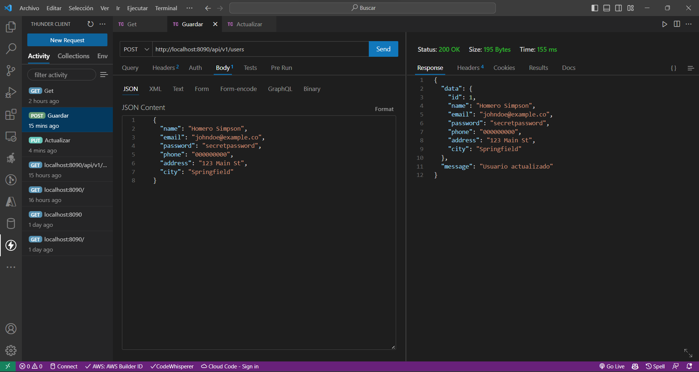
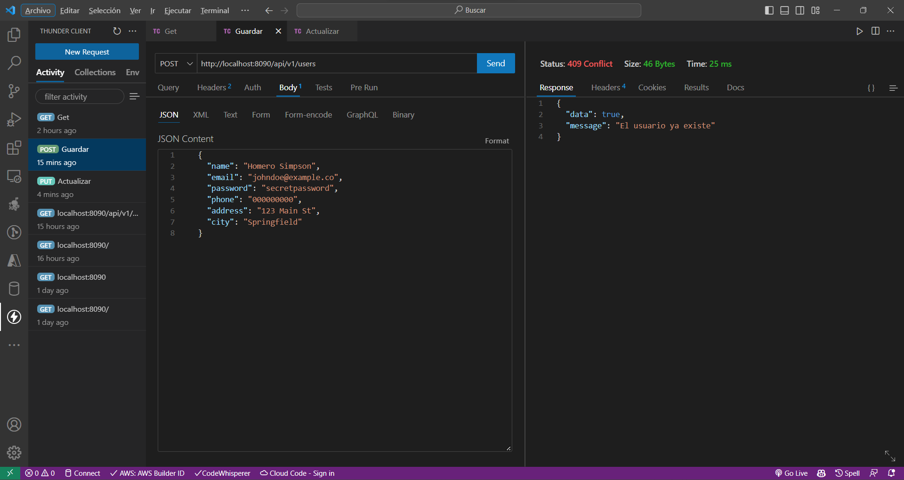
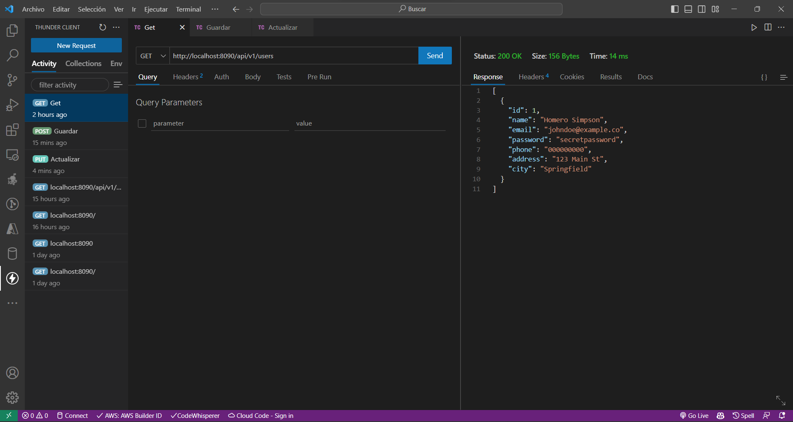
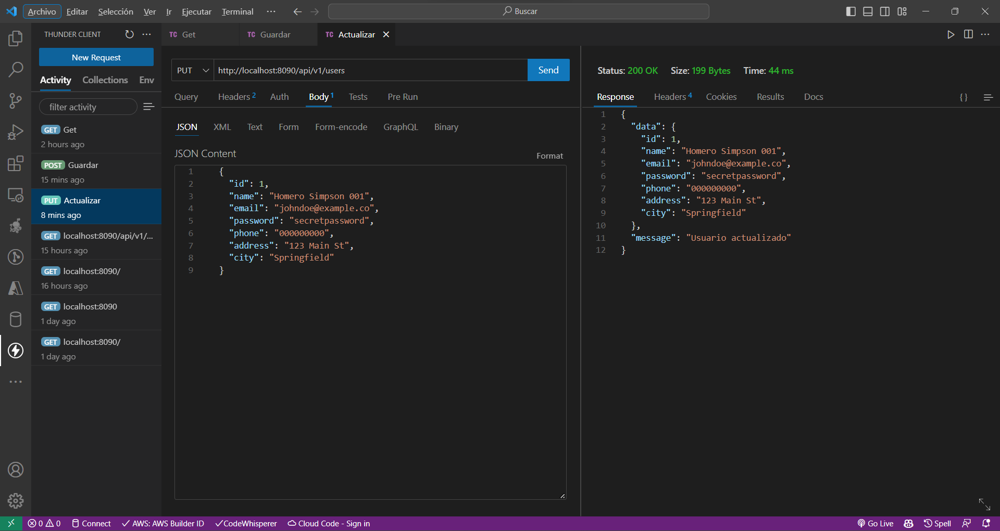
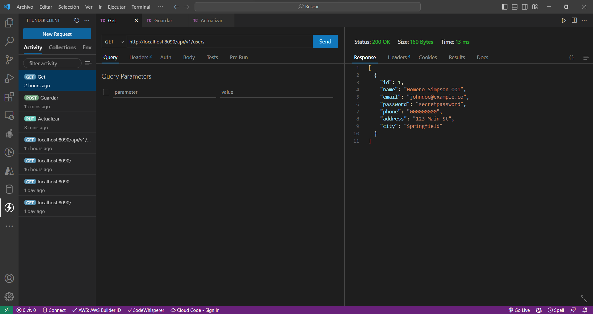

# Módulo 8: Método Actualizar.

## Creamos el Método Actualizar

En este caso hemos modificado el archivo UserServce particularmente el método actualizar, para que nos permita actualizar los datos de un usuario en la base de datos.

```java
// UserService

package com.example.RegistroUsuariosAplication.Users;

import org.springframework.beans.factory.annotation.Autowired;
import org.springframework.http.HttpStatus;
import org.springframework.http.ResponseEntity;
import org.springframework.stereotype.Service;

import java.util.HashMap;
import java.util.List;
import java.util.Optional;

@Service
public class UserService {

    private final UserRepository userRepository;

    @Autowired
    public UserService(UserRepository userRepository) {
        this.userRepository = userRepository;
    }

    public List<UserAplication> getUsers() {
        return this.userRepository.findAll();
    }

    public ResponseEntity<Object> newUser(UserAplication user) {
        Optional<UserAplication> existingUser = userRepository.findUserAplicationByName(user.getName());
        HashMap<String, Object> datos = new HashMap<String, Object>();

        if (existingUser.isPresent() && user.getId() == null) {
            datos.put("data", true);
            datos.put("message", "El usuario ya existe");
            return new ResponseEntity<>(
                    datos,
                    HttpStatus.CONFLICT
            );
        } else {
            userRepository.save(user);
            datos.put("data", user);
            if (user.getId() != null) {
                datos.put("message", "Usuario actualizado");
            } else {
                datos.put("message", "Usuario creado");
            }
            HttpStatus status = user.getId() != null ? HttpStatus.OK : HttpStatus.CREATED;
            return new ResponseEntity<>(
                    datos,
                    status
            );
        }
    }
}
```

``` java
// UserController

    @PutMapping
    public ResponseEntity<Object> actualizarUser(@RequestBody UserAplication user) {
        return userService.newUser(user);
    }
```

Cuando no existen Usuarios



Cuando creamos el usuario



Cuando intentamos volver a crear el usuario con los mismos datos



Cuando consultamos el id del usuario



Con el id del usuario podemos utilizar el método actualizar



Cuando consultamos los datos de los usuarios

