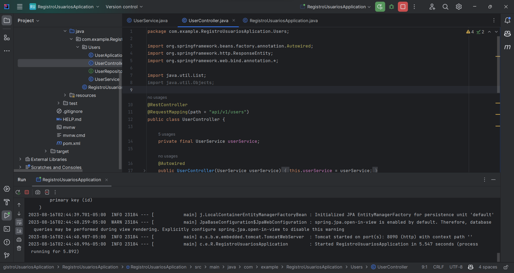
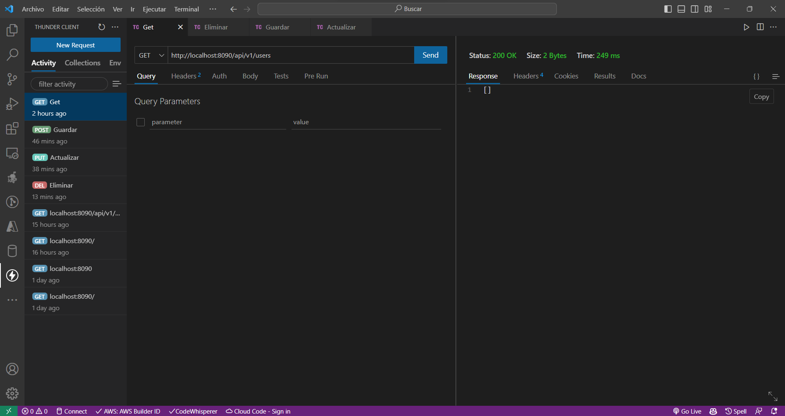
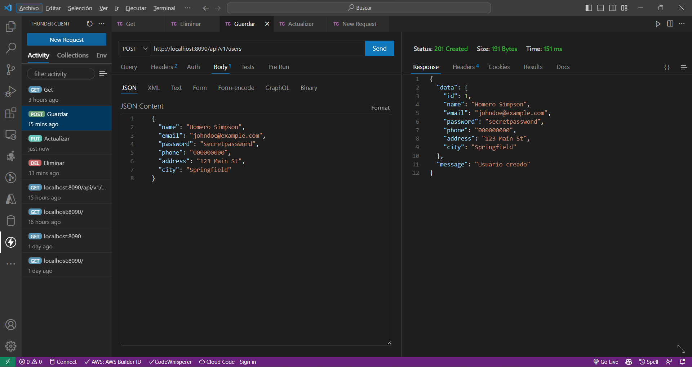
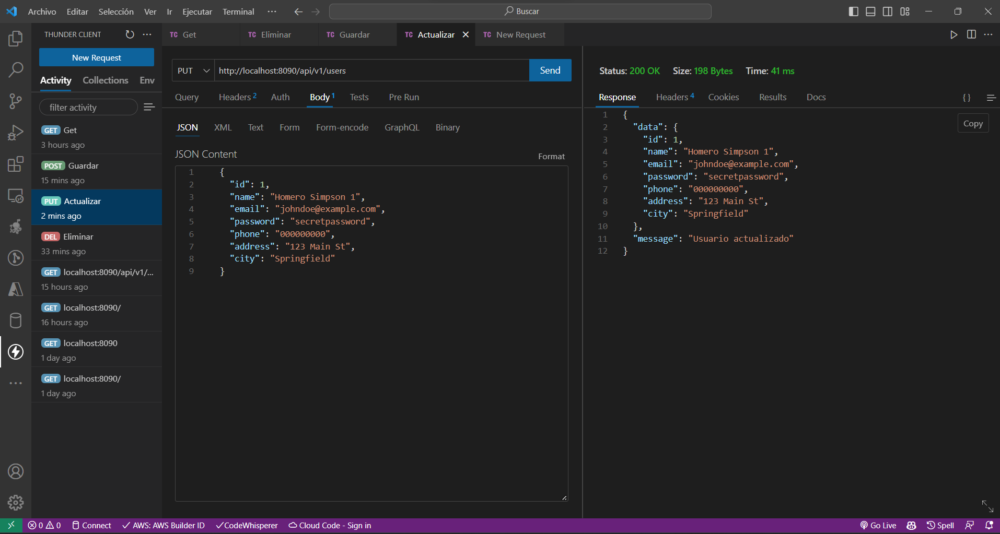
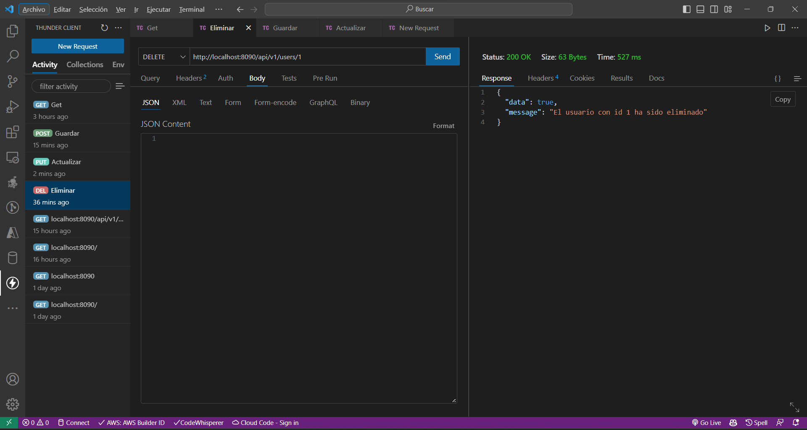

# Módulo 8: Método Eliminar.

## Creamos el Método Eliminar
Ahora crearemos el método eliminar.

``` java
//UserService
package com.example.RegistroUsuariosAplication.Users;

import org.springframework.beans.factory.annotation.Autowired;
import org.springframework.http.HttpStatus;
import org.springframework.http.ResponseEntity;
import org.springframework.stereotype.Service;

import java.util.HashMap;
import java.util.List;
import java.util.Optional;

@Service
public class UserService {

    private final UserRepository userRepository;

    @Autowired
    public UserService(UserRepository userRepository) {
        this.userRepository = userRepository;
    }

    public List<UserAplication> getUsers() {
        return userRepository.findAll();
    }

    public ResponseEntity<Object> createUser(UserAplication user) {
        Optional<UserAplication> existingUser = userRepository.findUserAplicationByName(user.getName());
        HashMap<String, Object> datos = new HashMap<>();

        if (existingUser.isPresent()) {
            datos.put("data", false);
            datos.put("message", "El usuario ya existe");
            return new ResponseEntity<>(datos, HttpStatus.CONFLICT);
        } else {
            UserAplication savedUser = userRepository.save(user);
            datos.put("data", savedUser);
            datos.put("message", "Usuario creado");

            return new ResponseEntity<>(datos, HttpStatus.CREATED);
        }
    }

    public ResponseEntity<Object> updateUser(UserAplication user) {
        Optional<UserAplication> existingUser = userRepository.findById(user.getId());
        HashMap<String, Object> datos = new HashMap<>();

        if (existingUser.isPresent()) {
            UserAplication savedUser = userRepository.save(user);
            datos.put("data", savedUser);
            datos.put("message", "Usuario actualizado");

            return new ResponseEntity<>(datos, HttpStatus.OK);
        } else {
            datos.put("data", false);
            datos.put("message", "El usuario con ID " + user.getId() + " no existe");
            return new ResponseEntity<>(datos, HttpStatus.NOT_FOUND);
        }
    }

    public ResponseEntity<Object> deleteUser(Long userId) {
        boolean exists = userRepository.existsById(userId);
        HashMap<String, Object> datos = new HashMap<>();

        if (!exists) {
            datos.put("data", false);
            datos.put("message", "El usuario con id " + userId + " no existe");
            return new ResponseEntity<>(datos, HttpStatus.NOT_FOUND);
        }

        userRepository.deleteById(userId);
        datos.put("data", true);
        datos.put("message", "El usuario con id " + userId + " ha sido eliminado");
        return new ResponseEntity<>(datos, HttpStatus.OK);
    }
}

```

``` java
//UserController 
package com.example.RegistroUsuariosAplication.Users;

import org.springframework.beans.factory.annotation.Autowired;
import org.springframework.http.ResponseEntity;
import org.springframework.web.bind.annotation.*;

import java.util.List;
import java.util.Objects;

@RestController
@RequestMapping(path = "api/v1/users")
public class UserController {

    private final UserService userService;

    @Autowired
    public UserController(UserService userService) {
        this.userService = userService;
    }

    @GetMapping
    public List<UserAplication> getAllUsers() {
        return userService.getUsers();
    }

    @PostMapping
    public ResponseEntity<Object> crearUser(@RequestBody UserAplication user) {
        return userService.createUser(user);
    }

    @PutMapping
    public ResponseEntity<Object> actualizarUser(@RequestBody UserAplication user) {
        return userService.updateUser(user);
    }

    @DeleteMapping(path = "{userId}")
    public ResponseEntity<Object> eliminarUser(@PathVariable("userId") Long userId) {
        return userService.deleteUser(userId);
    }
}
```
Verificamos que todo funcione de la forma correcta

Corremos nuestro servidor.



Cuando consultamos la base de datos vacía nos debe devolver un arreglo vacío.



Cuando creamos un usuario nos debe devolver el usuario creado.



Ahora cuando actualicemos debe salir el usuario actualizado.



Y finalmente al pasar el Id debe salir el mensaje de que el usuario ha sido eliminado.



Con esto hemos creado un CRUD completo para la gestión de usuarios